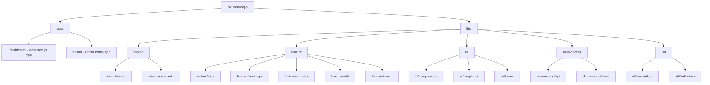
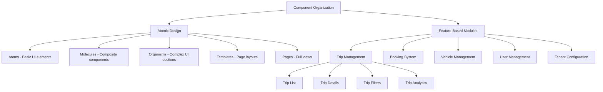
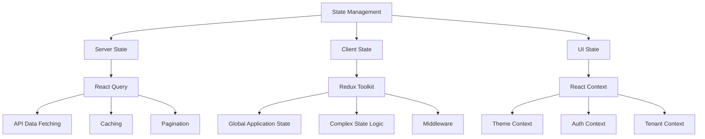
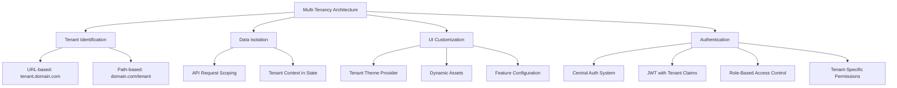
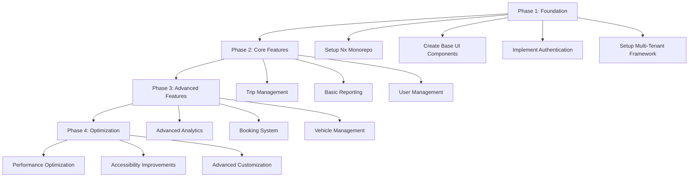
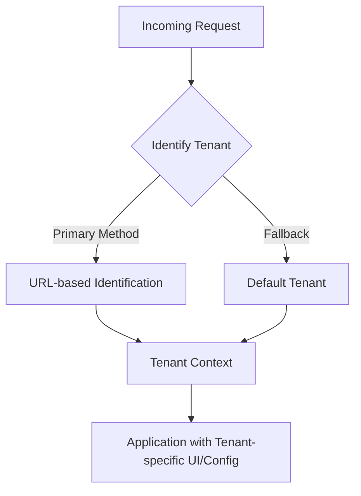
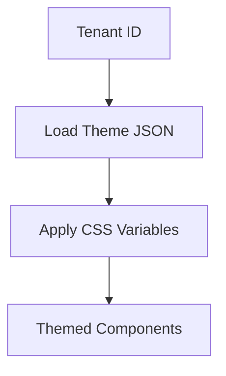
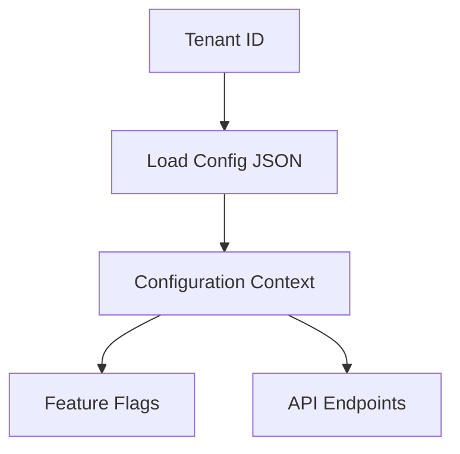
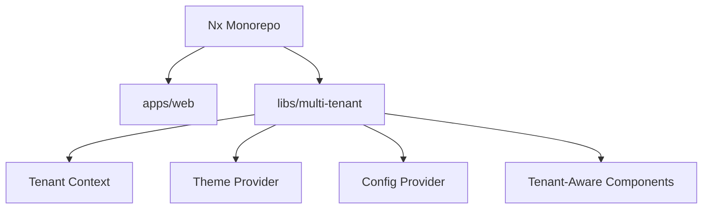

# Multi-Tenant Transportation Dashboard Architecture Plan

## 1. Repository Structure and Architecture Overview

I recommend using an **Nx monorepo** for this project, as it provides several advantages for your specific requirements:



### Key Structure Components:

1. **Apps Directory**:
   - `dashboard`: Main Next.js application for the transportation dashboard
   - `admin` (future): Admin portal for managing tenants and global settings

2. **Libs Directory**:
   - `shared`: Common types, interfaces, constants, and utilities
   - `feature`: Feature-specific modules (trips, bookings, vehicles, etc.)
   - `ui`: Reusable UI components, templates, and theming
   - `data-access`: API interfaces, state management, and data fetching
   - `util`: Utility functions for formatting, validation, etc.

## 2. Component Organization

I recommend a feature-based organization with atomic design principles for UI components:



### Component Structure:

1. **UI Components Library**:
   - Base components (buttons, inputs, cards)
   - Composite components (forms, data tables, search bars)
   - Layout components (sidebar, header, content areas)
   - Theme providers and styling utilities

2. **Feature Modules**:
   - Each feature (trips, bookings, vehicles) as a separate module
   - Feature-specific components, hooks, and utilities
   - Feature-specific state management

3. **Page Templates**:
   - Dashboard layouts
   - Detail view layouts
   - List view layouts
   - Settings layouts

## 3. State Management Approach

For your requirements, I recommend a hybrid approach:



### State Management Components:

1. **Server State** - React Query:
   - Efficient data fetching with automatic caching
   - Pagination and infinite scrolling for large datasets
   - Optimistic updates for better UX
   - Background refetching for real-time data

2. **Complex Application State** - Redux Toolkit:
   - Global state that affects multiple components
   - Complex state transitions and logic
   - Middleware for side effects (e.g., logging, analytics)
   - DevTools for debugging

3. **UI State** - React Context:
   - Theme and styling preferences
   - Authentication state
   - Current tenant context
   - Feature flags and user preferences

## 4. Authentication and Multi-Tenancy Implementation



### Multi-Tenancy Implementation:

1. **Tenant Identification**:
   - URL-based approach (tenant.yourdomain.com or yourdomain.com/tenant)
   - Tenant context stored in application state
   - Tenant information included in all API requests

2. **Data Isolation**:
   - Tenant ID included in all API requests
   - Backend responsible for data isolation (your .NET backend)
   - Client-side filtering as a secondary measure

3. **UI Customization**:
   - Tenant-specific theme provider
   - Dynamic loading of tenant assets (logos, colors)
   - Configuration-driven feature availability

4. **Authentication Flow**:
   - Central authentication system with tenant context
   - JWT tokens with tenant claims
   - Role-based access control within each tenant
   - Tenant-specific permission sets

## 5. Technical Stack and Key Decisions

### Frontend Stack:

1. **Framework**: Next.js with App Router
2. **UI Components**: 
   - Tailwind CSS for styling
   - Shadcn UI for base components (built on Radix UI)
   - Custom components for specific needs

3. **State Management**:
   - React Query for server state
   - Redux Toolkit for complex application state
   - React Context for UI state and theming

4. **Data Visualization**:
   - Recharts for charts and graphs
   - React Table for data tables with virtualization

5. **Form Handling**:
   - React Hook Form for form state
   - Zod for validation

6. **Performance Optimizations**:
   - Code splitting and lazy loading
   - Static generation where possible
   - Incremental Static Regeneration for semi-dynamic content
   - Data virtualization for large datasets
   - Optimized bundle sizes with tree shaking

### Development Tools:

1. **Build & Development**:
   - Nx for monorepo management
   - TypeScript for type safety
   - ESLint and Prettier for code quality

2. **Testing**:
   - Jest for unit testing
   - React Testing Library for component testing
   - Cypress for E2E testing

3. **CI/CD**:
   - GitHub Actions or Azure DevOps
   - Nx Cloud for distributed task execution

## 6. Nx Monorepo vs Standard Monorepo Analysis

### Pros of Nx Monorepo for Your Use Case:

1. **Efficient Dependency Management**:
   - Shared dependencies across apps and libraries
   - Consistent versioning and fewer conflicts

2. **Code Sharing and Reusability**:
   - Easy extraction of shared components and logic
   - Clear boundaries between features and modules

3. **Build Performance**:
   - Incremental builds and affected-only testing
   - Distributed task execution with Nx Cloud
   - Caching for faster builds

4. **Developer Experience**:
   - Consistent tooling and commands
   - Integrated code generation
   - Visualization of project dependencies

5. **Scalability**:
   - Well-suited for enterprise applications
   - Supports growing to many apps and libraries
   - Enforces architectural boundaries

### Cons of Nx Monorepo:

1. **Learning Curve**:
   - Additional concepts and tools to learn
   - More complex setup initially

2. **Overhead for Small Projects**:
   - May be overkill for very simple applications
   - Initial setup time is higher

3. **Build Configuration Complexity**:
   - More complex configuration for custom build processes
   - May require deeper understanding of the build system

### Why Nx is Better for Your Specific Use Case:

1. **Multi-Tenant Enterprise Application**:
   - You need to scale to many tenants and users
   - Shared code between tenant implementations is crucial

2. **Performance Requirements**:
   - Nx's build optimizations help with bundle size
   - Code splitting and lazy loading are easier to implement

3. **Feature Modularity**:
   - Clear boundaries between features
   - Ability to develop features in isolation

4. **Future Expansion**:
   - Easy to add new applications (admin portal, etc.)
   - Consistent developer experience as the team grows

## 7. Implementation Roadmap



### Phase 1: Foundation (4-6 weeks)
- Set up Nx monorepo structure
- Implement base UI components and theming
- Create authentication and multi-tenant framework
- Develop core layouts and navigation

### Phase 2: Core Features (6-8 weeks)
- Implement trip management (listing, details, filtering)
- Develop basic reporting and analytics
- Create user management interfaces
- Build search and filtering capabilities

### Phase 3: Advanced Features (8-10 weeks)
- Implement advanced analytics and dashboards
- Develop booking system
- Create vehicle management interfaces
- Build notification system

### Phase 4: Optimization (4-6 weeks)
- Performance optimization
- Accessibility improvements
- Enhanced customization options
- Advanced tenant management

## 8. Detailed File Structure

```
nx-workspace/
├── apps/
│   ├── dashboard/                # Main Next.js application
│   │   ├── app/                  # Next.js App Router
│   │   │   ├── (dashboard)/      # Dashboard routes
│   │   │   │   ├── trips/        # Trip management pages
│   │   │   │   ├── bookings/     # Booking management pages
│   │   │   │   ├── vehicles/     # Vehicle management pages
│   │   │   │   └── settings/     # Settings pages
│   │   │   ├── api/              # API routes (proxies to backend)
│   │   │   ├── auth/             # Authentication pages
│   │   │   └── tenant/           # Tenant-specific routes
│   │   ├── public/               # Static assets
│   │   └── project.json          # Nx project configuration
│   └── admin/                    # (Future) Admin portal
├── libs/
│   ├── shared/
│   │   ├── types/                # Shared TypeScript types
│   │   └── constants/            # Shared constants
│   ├── feature/
│   │   ├── trips/                # Trip management feature
│   │   ├── bookings/             # Booking management feature
│   │   ├── vehicles/             # Vehicle management feature
│   │   ├── auth/                 # Authentication feature
│   │   └── tenant/               # Tenant management feature
│   ├── ui/
│   │   ├── components/           # Reusable UI components
│   │   │   ├── atoms/            # Basic UI elements
│   │   │   ├── molecules/        # Composite components
│   │   │   └── organisms/        # Complex UI sections
│   │   ├── templates/            # Page templates
│   │   └── theme/                # Theming and styling
│   ├── data-access/
│   │   ├── api/                  # API interfaces
│   │   └── store/                # State management
│   └── util/
│       ├── formatters/           # Data formatting utilities
│       └── validators/           # Validation utilities
├── tools/                        # Workspace tooling
├── nx.json                       # Nx configuration
└── package.json                  # Workspace dependencies
```

## 9. Key Technical Decisions and Rationales

1. **Next.js with App Router**:
   - **Rationale**: Provides server-side rendering, static generation, and API routes in one framework
   - **Benefits**: Better SEO, faster initial load times, simplified routing

2. **Nx Monorepo**:
   - **Rationale**: Enables code sharing, consistent tooling, and efficient builds
   - **Benefits**: Scales well for enterprise applications, enforces architectural boundaries

3. **React Query + Redux Toolkit**:
   - **Rationale**: Separates server state from client state for better management
   - **Benefits**: Optimized data fetching, caching, and complex state management

4. **Tailwind CSS + Shadcn UI**:
   - **Rationale**: Provides utility-first styling with accessible, customizable components
   - **Benefits**: Faster development, consistent design, smaller bundle sizes

5. **Feature-Based Organization**:
   - **Rationale**: Groups related code by business domain rather than technical role
   - **Benefits**: Better code organization, easier to understand and maintain

6. **Tenant-Specific Theming**:
   - **Rationale**: Enables customization without code changes
   - **Benefits**: Consistent tenant branding, configuration-driven customization

## 10. Detailed Multi-Tenancy Implementation

### Tenant Identification Strategy

We'll implement a flexible but simple tenant identification system:



#### Implementation:

- Use Next.js middleware to extract tenant information from the URL (either subdomain or path)
- Store tenant ID in a cookie for persistence
- Provide a simple React context to make tenant information available throughout the application

### Tenant-Specific Theming

We'll use a simple CSS variables approach with Tailwind CSS:



#### Implementation:

- Store tenant themes as simple JSON files
- Use CSS variables for colors, logos, and basic styling
- Extend Tailwind configuration to use these variables
- Create a small set of tenant-aware UI components

### Configuration Management

We'll use a file-based approach for simplicity:



#### Implementation:

- Store tenant configurations as JSON files in the codebase
- Create a simple configuration provider component
- Implement basic feature flags for tenant-specific functionality

### Code Structure



### Implementation Steps

#### Step 1: Create Multi-Tenant Library

```bash
nx g @nx/next:library multi-tenant --directory=libs/multi-tenant
```

#### Step 2: Implement Tenant Identification

```typescript
// libs/multi-tenant/src/lib/middleware.ts
import { NextRequest, NextResponse } from 'next/server';

export function tenantMiddleware(req: NextRequest) {
  const tenantId = identifyTenant(req);
  
  const response = NextResponse.next();
  response.cookies.set('tenant-id', tenantId);
  
  return response;
}

function identifyTenant(req: NextRequest): string {
  // Extract from path (e.g., /tenant1/dashboard)
  const path = req.nextUrl.pathname;
  const pathSegments = path.split('/').filter(Boolean);
  
  if (pathSegments.length > 0) {
    const potentialTenant = pathSegments[0];
    if (isValidTenant(potentialTenant)) {
      return potentialTenant;
    }
  }
  
  // Extract from subdomain (e.g., tenant1.example.com)
  const hostname = req.headers.get('host') || '';
  const subdomain = hostname.split('.')[0];
  
  if (isValidTenant(subdomain)) {
    return subdomain;
  }
  
  // Default tenant
  return 'default';
}

function isValidTenant(tenantId: string): boolean {
  const validTenants = ['tenant1', 'tenant2', 'tenant3'];
  return validTenants.includes(tenantId);
}
```

#### Step 3: Create Tenant Context

```typescript
// libs/multi-tenant/src/lib/tenant-context.tsx
'use client';

import { createContext, useContext, ReactNode, useState, useEffect } from 'react';
import { getCookie } from 'cookies-next';

interface TenantContextType {
  tenantId: string;
}

const TenantContext = createContext<TenantContextType>({ tenantId: 'default' });

export function TenantProvider({ children }: { children: ReactNode }) {
  const [tenantId, setTenantId] = useState<string>('default');
  
  useEffect(() => {
    const id = getCookie('tenant-id') as string || 'default';
    setTenantId(id);
  }, []);
  
  return (
    <TenantContext.Provider value={{ tenantId }}>
      {children}
    </TenantContext.Provider>
  );
}

export function useTenant() {
  return useContext(TenantContext);
}
```

#### Step 4: Implement Theme Provider

```typescript
// libs/multi-tenant/src/lib/theme-provider.tsx
'use client';

import { ReactNode, useEffect } from 'react';
import { useTenant } from './tenant-context';

// Simple theme definitions
const themes = {
  default: {
    primaryColor: '#0f172a',
    secondaryColor: '#64748b',
    accentColor: '#3b82f6',
    fontFamily: 'Inter, sans-serif',
  },
  tenant1: {
    primaryColor: '#2563eb',
    secondaryColor: '#93c5fd',
    accentColor: '#1e40af',
    fontFamily: 'Inter, sans-serif',
  },
  tenant2: {
    primaryColor: '#16a34a',
    secondaryColor: '#86efac',
    accentColor: '#166534',
    fontFamily: 'Inter, sans-serif',
  },
};

export function ThemeProvider({ children }: { children: ReactNode }) {
  const { tenantId } = useTenant();
  const theme = themes[tenantId] || themes.default;
  
  useEffect(() => {
    // Apply theme as CSS variables
    const root = document.documentElement;
    
    Object.entries(theme).forEach(([key, value]) => {
      root.style.setProperty(`--${key}`, value);
    });
  }, [theme]);
  
  return <>{children}</>;
}
```

#### Step 5: Create Configuration Provider

```typescript
// libs/multi-tenant/src/lib/config-provider.tsx
'use client';

import { createContext, useContext, ReactNode } from 'react';
import { useTenant } from './tenant-context';

// Simple configuration definitions
const configurations = {
  default: {
    features: {
      advancedReporting: false,
      liveTracking: true,
    },
    api: {
      baseUrl: '/api',
    },
  },
  tenant1: {
    features: {
      advancedReporting: true,
      liveTracking: true,
    },
    api: {
      baseUrl: '/api/tenant1',
    },
  },
  tenant2: {
    features: {
      advancedReporting: false,
      liveTracking: true,
    },
    api: {
      baseUrl: '/api/tenant2',
    },
  },
};

const ConfigContext = createContext(configurations.default);

export function ConfigProvider({ children }: { children: ReactNode }) {
  const { tenantId } = useTenant();
  const config = configurations[tenantId] || configurations.default;
  
  return (
    <ConfigContext.Provider value={config}>
      {children}
    </ConfigContext.Provider>
  );
}

export function useConfig() {
  return useContext(ConfigContext);
}

// Simple feature flag component
export function FeatureFlag({ 
  feature, 
  children, 
  fallback = null 
}: { 
  feature: string; 
  children: ReactNode; 
  fallback?: ReactNode;
}) {
  const config = useConfig();
  const isEnabled = config.features[feature];
  
  return isEnabled ? <>{children}</> : <>{fallback}</>;
}
```

#### Step 6: Create Tenant-Aware Components

```typescript
// libs/multi-tenant/src/lib/tenant-logo.tsx
'use client';

import Image from 'next/image';
import { useTenant } from './tenant-context';

export function TenantLogo({ 
  width = 150, 
  height = 40,
  className = '',
}: { 
  width?: number; 
  height?: number;
  className?: string;
}) {
  const { tenantId } = useTenant();
  const logoPath = `/tenants/${tenantId}/logo.svg`;
  
  return (
    <Image
      src={logoPath}
      alt="Company Logo"
      width={width}
      height={height}
      className={className}
    />
  );
}
```

#### Step 7: Update Root Layout

```typescript
// apps/web/src/app/layout.tsx
import './global.css';
import { TenantProvider, ThemeProvider, ConfigProvider } from '@nx-workspace/multi-tenant';

export const metadata = {
  title: 'Transportation Dashboard',
  description: 'Multi-tenant transportation dashboard',
};

export default function RootLayout({
  children,
}: {
  children: React.ReactNode;
}) {
  return (
    <html lang="en">
      <body>
        <TenantProvider>
          <ThemeProvider>
            <ConfigProvider>
              {children}
            </ConfigProvider>
          </ThemeProvider>
        </TenantProvider>
      </body>
    </html>
  );
}
```

#### Step 8: Update Tailwind Configuration

```javascript
// tailwind.config.js
module.exports = {
  theme: {
    extend: {
      colors: {
        primary: 'var(--primaryColor)',
        secondary: 'var(--secondaryColor)',
        accent: 'var(--accentColor)',
      },
      fontFamily: {
        sans: 'var(--fontFamily)',
      },
    },
  },
  // ...other config
};
```

### Asset Management

Create a simple directory structure for tenant assets:

```
/public
  /tenants
    /default
      logo.svg
      favicon.ico
    /tenant1
      logo.svg
      favicon.ico
    /tenant2
      logo.svg
      favicon.ico
```

### Example Usage

Here's how you would use these components in a dashboard page:

```tsx
// apps/web/src/app/dashboard/page.tsx
import { TenantLogo, FeatureFlag } from '@nx-workspace/multi-tenant';

export default function DashboardPage() {
  return (
    <div className="min-h-screen bg-gray-50">
      <header className="bg-primary text-white p-4">
        <div className="container mx-auto flex items-center">
          <TenantLogo className="mr-4" />
          <h1 className="text-xl font-bold">Dashboard</h1>
        </div>
      </header>
      
      <main className="container mx-auto p-4">
        <div className="bg-white rounded shadow p-4">
          <h2 className="text-xl font-bold text-primary">Transportation Overview</h2>
          {/* Dashboard content */}
        </div>
        
        <FeatureFlag feature="advancedReporting">
          <div className="mt-8 p-4 bg-white rounded shadow">
            <h2 className="text-xl font-bold text-primary">Advanced Reporting</h2>
            <p>This feature is only available for specific tenants.</p>
          </div>
        </FeatureFlag>
      </main>
    </div>
  );
}
```

### Future Expansion

This simplified approach provides a foundation that can be expanded as your needs grow:

1. **Database-driven configuration**: Replace JSON files with database storage
2. **Admin interface**: Add a UI for managing tenant configurations
3. **More sophisticated theming**: Expand theme capabilities with more variables
4. **Enhanced tenant identification**: Add support for more identification methods

By starting with this simpler approach, you can quickly implement multi-tenancy while maintaining the flexibility to evolve the system as your requirements become more complex.