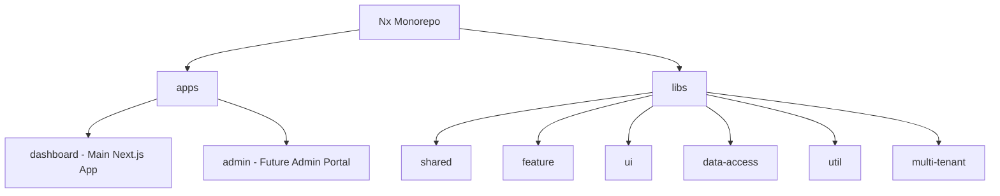
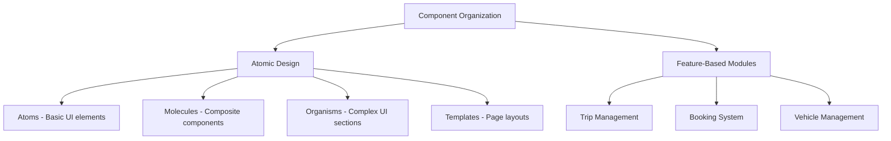
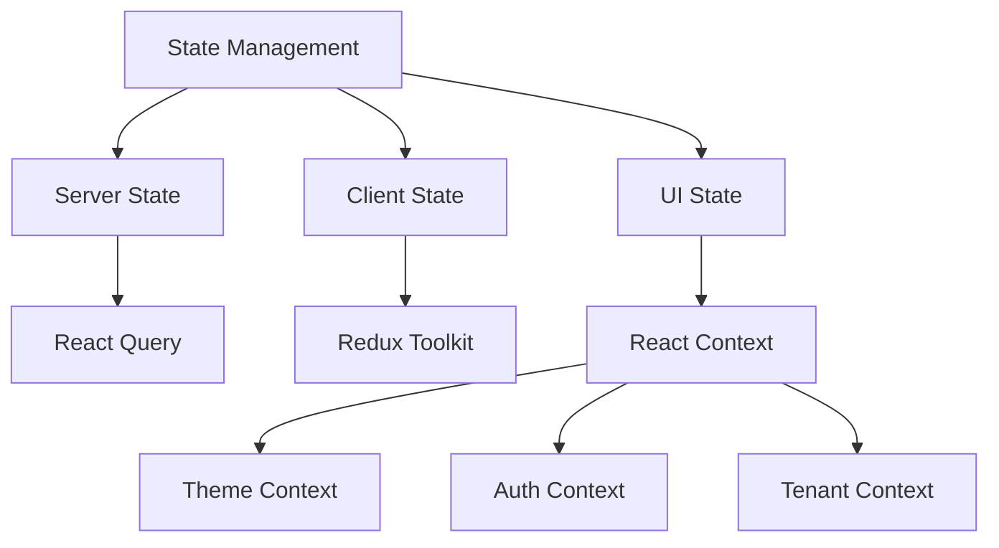
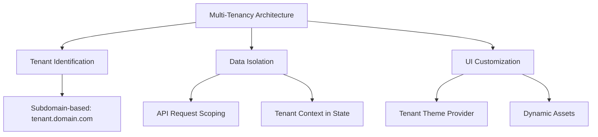
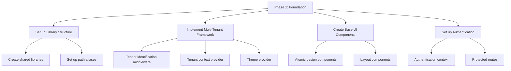
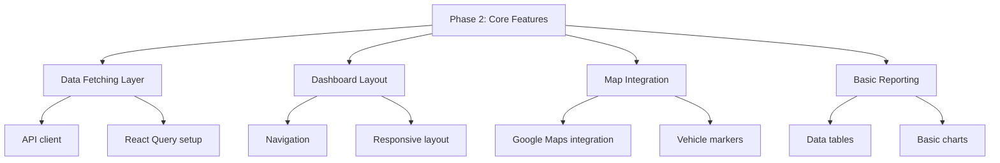
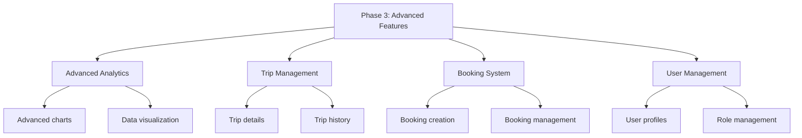

# Multi-Tenant Dashboard Migration Plan

## 1. Analysis Summary

### Current Project Structure
The current Nx workspace has a basic structure with:
- A Next.js application (`apps/web`) using the App Router
- Basic API routes (`hello` and `users`)
- Tailwind CSS for styling
- No shared libraries yet (empty `packages` directory)
- Standard Nx configuration with Next.js, Playwright, ESLint, and Jest plugins

### Multi-Tenant Architecture Requirements
Based on the multi-tenant-dashboard-architecture.md document and our discussions:

1. **Tenant Identification**:
   - Subdomain-based approach (e.g., tenant1.domain.com)
   - Tenant context stored in application state

2. **UI Customization**:
   - Minimal UI customization (theming, colors, logos)
   - Tenant-specific theme provider

3. **Data Isolation**:
   - Primarily handled by the backend
   - Tenant ID included in all API requests

4. **Project Timeline**:
   - Long-term project (6+ months)
   - Focus on foundation first, then minimal viable product with basic tenant support

## 2. Key Architectural Principles

Based on the analysis, here are the key architectural principles that should guide our migration:

### 1. Monorepo Structure with Clear Boundaries



- **Principle**: Organize code by domain and technical role
- **Implementation**: Create a structured library organization with clear boundaries
- **Benefit**: Enables code sharing, enforces architectural boundaries, and improves maintainability

### 2. Feature-Based Organization with Atomic Design



- **Principle**: Organize components by feature and complexity
- **Implementation**: Apply atomic design principles to UI components
- **Benefit**: Improves component reusability and maintainability

### 3. Hybrid State Management



- **Principle**: Use the right tool for each type of state
- **Implementation**: React Query for server state, Redux Toolkit for complex application state, React Context for UI state
- **Benefit**: Optimizes data fetching, caching, and state management

### 4. Multi-Tenancy Implementation



- **Principle**: Implement multi-tenancy at all layers of the application
- **Implementation**: Tenant identification middleware, tenant context provider, theme provider
- **Benefit**: Enables customization and data isolation for each tenant

## 3. Implementation Roadmap

### Phase 1: Foundation (2-3 months)



1. **Set up Library Structure**
   - Create shared libraries (ui, feature, data-access, util, multi-tenant)
   - Set up path aliases in tsconfig.base.json
   - Configure Nx workspace for optimal development experience

2. **Implement Multi-Tenant Framework**
   - Create tenant identification middleware
   - Implement tenant context provider
   - Develop theme provider with tenant-specific theming
   - Set up configuration provider for feature flags

3. **Create Base UI Components**
   - Implement atomic design components (buttons, inputs, cards)
   - Create layout components (sidebar, header, content areas)
   - Develop tenant-aware components (logo, theme)

4. **Set up Authentication**
   - Implement authentication context
   - Create protected routes
   - Integrate tenant context with authentication

### Phase 2: Core Features (2-3 months)



1. **Data Fetching Layer**
   - Implement API client with tenant context
   - Set up React Query for data fetching and caching
   - Create data access libraries for each feature

2. **Dashboard Layout**
   - Develop main dashboard layout
   - Implement navigation components
   - Create responsive layout system

3. **Map Integration**
   - Integrate Google Maps
   - Implement vehicle markers and tracking
   - Create map controls and filters

4. **Basic Reporting**
   - Develop data tables and lists
   - Implement basic charts and graphs
   - Create filtering and sorting capabilities

### Phase 3: Advanced Features (2-3 months)



1. **Advanced Analytics**
   - Implement advanced charts and graphs
   - Create dashboard widgets
   - Develop data visualization components

2. **Trip Management**
   - Create trip details view
   - Implement trip history and tracking
   - Develop trip filters and search

3. **Booking System**
   - Implement booking creation and management
   - Create booking calendar and scheduling
   - Develop notification system

4. **User Management**
   - Create user profiles and settings
   - Implement role-based access control
   - Develop user administration

## 4. Detailed Library Structure

```
nx-workspace/
├── apps/
│   └── web/                # Main Next.js application
│       ├── app/            # Next.js App Router
│       │   ├── (dashboard)/# Dashboard routes
│       │   ├── api/        # API routes
│       │   ├── auth/       # Authentication pages
│       │   └── middleware.ts # Tenant identification middleware
├── libs/
│   ├── shared/
│   │   ├── types/          # Shared TypeScript types
│   │   └── constants/      # Shared constants
│   ├── multi-tenant/       # Multi-tenancy implementation
│   │   ├── middleware/     # Tenant identification middleware
│   │   ├── context/        # Tenant context provider
│   │   ├── theme/          # Theme provider
│   │   └── config/         # Configuration provider
│   ├── feature/
│   │   ├── auth/           # Authentication feature
│   │   ├── dashboard/      # Dashboard feature
│   │   ├── map/            # Map feature
│   │   ├── trips/          # Trip management feature
│   │   └── bookings/       # Booking management feature
│   ├── ui/
│   │   ├── components/     # Reusable UI components
│   │   │   ├── atoms/      # Basic UI elements
│   │   │   ├── molecules/  # Composite components
│   │   │   └── organisms/  # Complex UI sections
│   │   ├── templates/      # Page templates
│   │   └── theme/          # Theming and styling
│   ├── data-access/
│   │   ├── api/            # API interfaces
│   │   └── store/          # State management
│   └── util/
│       ├── formatters/     # Data formatting utilities
│       └── validators/     # Validation utilities
```

## 5. Multi-Tenant Implementation Details

### Tenant Identification Middleware

```typescript
// libs/multi-tenant/middleware/tenant-middleware.ts
import { NextRequest, NextResponse } from 'next/server';

export function tenantMiddleware(req: NextRequest) {
  const tenantId = identifyTenant(req);
  
  const response = NextResponse.next();
  response.cookies.set('tenant-id', tenantId);
  
  return response;
}

function identifyTenant(req: NextRequest): string {
  // Extract from subdomain (e.g., tenant1.example.com)
  const hostname = req.headers.get('host') || '';
  const subdomain = hostname.split('.')[0];
  
  if (isValidTenant(subdomain)) {
    return subdomain;
  }
  
  // Default tenant
  return 'default';
}

function isValidTenant(tenantId: string): boolean {
  const validTenants = ['tenant1', 'tenant2', 'tenant3'];
  return validTenants.includes(tenantId);
}
```

### Tenant Context Provider

```typescript
// libs/multi-tenant/context/tenant-context.tsx
'use client';

import { createContext, useContext, ReactNode, useState, useEffect } from 'react';
import { getCookie } from 'cookies-next';

interface TenantContextType {
  tenantId: string;
}

const TenantContext = createContext<TenantContextType>({ tenantId: 'default' });

export function TenantProvider({ children }: { children: ReactNode }) {
  const [tenantId, setTenantId] = useState<string>('default');
  
  useEffect(() => {
    const id = getCookie('tenant-id') as string || 'default';
    setTenantId(id);
  }, []);
  
  return (
    <TenantContext.Provider value={{ tenantId }}>
      {children}
    </TenantContext.Provider>
  );
}

export function useTenant() {
  return useContext(TenantContext);
}
```

### Theme Provider

```typescript
// libs/multi-tenant/theme/theme-provider.tsx
'use client';

import { ReactNode, useEffect } from 'react';
import { useTenant } from '../context/tenant-context';

// Simple theme definitions
const themes = {
  default: {
    primaryColor: '#0f172a',
    secondaryColor: '#64748b',
    accentColor: '#3b82f6',
    fontFamily: 'Inter, sans-serif',
  },
  tenant1: {
    primaryColor: '#2563eb',
    secondaryColor: '#93c5fd',
    accentColor: '#1e40af',
    fontFamily: 'Inter, sans-serif',
  },
  tenant2: {
    primaryColor: '#16a34a',
    secondaryColor: '#86efac',
    accentColor: '#166534',
    fontFamily: 'Inter, sans-serif',
  },
};

export function ThemeProvider({ children }: { children: ReactNode }) {
  const { tenantId } = useTenant();
  const theme = themes[tenantId] || themes.default;
  
  useEffect(() => {
    // Apply theme as CSS variables
    const root = document.documentElement;
    
    Object.entries(theme).forEach(([key, value]) => {
      root.style.setProperty(`--${key}`, value);
    });
  }, [theme]);
  
  return <>{children}</>;
}
```

## 6. Next Steps

1. **Immediate Actions**:
   - Create the library structure in the Nx workspace
   - Implement the multi-tenant framework (middleware, context, theme)
   - Set up the base UI components

2. **Technical Decisions**:
   - Confirm the state management approach (React Query + Redux Toolkit + Context)
   - Decide on the UI component library (build custom or use existing)
   - Determine the authentication strategy

3. **Development Workflow**:
   - Set up CI/CD pipeline
   - Establish coding standards and documentation practices
   - Create a development and testing strategy

## 7. Conclusion

This migration plan provides a comprehensive approach to implementing the multi-tenant dashboard architecture in the current Nx project. By following the outlined architectural principles and implementation roadmap, we can create a scalable, maintainable, and feature-rich dashboard application that supports multiple tenants.

The plan focuses on establishing a solid foundation first, with the right library structure and multi-tenancy framework, before building out the core features and advanced functionality. This approach aligns with the long-term project timeline and ensures that we can create a minimal viable product with basic tenant support before adding more advanced features.